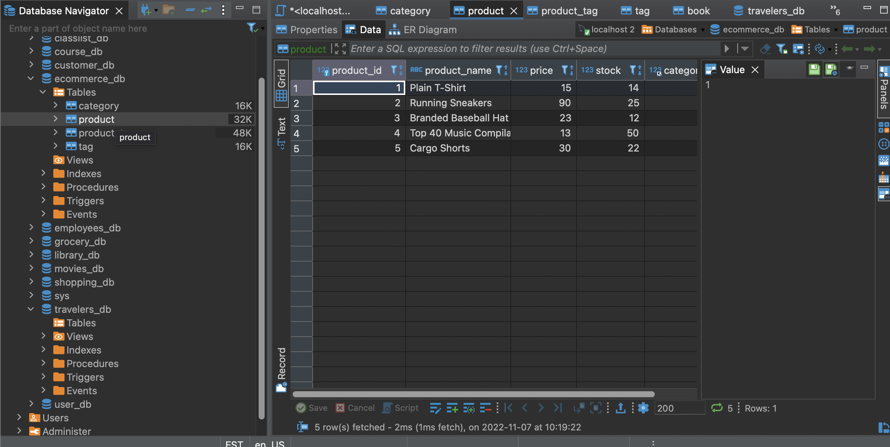
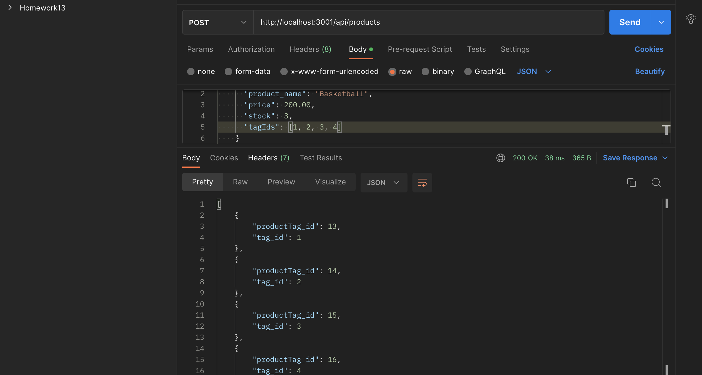

# E-Commerce_Back_End

## Table of Contents
- [Project description](#Description)
- [Usage](#Usage)
- [Installation](#Installation)
- [Contributions](#Contributions)
- [Questions](#Questions)

## Description
This assignment requires building the back end for an e-commerce site. It uses the Express.js API and Sequelize to interact with a MySQL database.

## Usage
Use the command line to retrieve, create, update, and delete data from an ecommerce database .
https://mmllively.github.io/E-Commerce_Back_End/

## Installation
express, dotenv, node.js, sequelize & mysql2.

## Contributions
UCF TA's and fellow classmates.

## Questions - Link to Instructional Video
https://app.castify.com/view/57ed2567-d6ea-404e-b20f-142f3a68fa9a